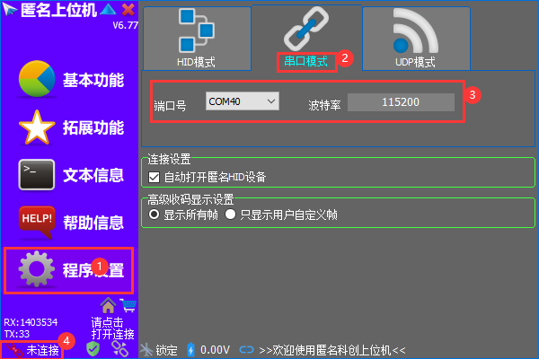

### MPU6050 姿态解算

## 1. 使用说明

 - 使用Type-C线连接Quark与电脑
 - 打开电脑打开匿名上位机`ANO_V6.exe`
 - Quark使用ssh或键盘控制，不要使用串口连接，串口用来传输数据给上位机。
 - 输入命令`python main.py`运行，运行时请将Quark平放置桌面上，初始化时不要乱动。
 - 匿名上位机在`程序设置 -> 串口模式`，选择Quark的串口，波特率为`115200`，再点击右下角的`未连接`进行连接。(见下图)
 - 匿名上位机中`拓展功能 -> 飞控状态`，查看Quark角度。
 
 
## 2. 目录说明
 
 - `ano_dt.py` 为与匿名上位机的通信协议。
 - `imu.py` 为姿态解算，使用`Mahony`姿态结算算法进行解算。
 - `mpu6050.py` 为MPU6050驱动文件。
 - `main.py` 为主文件。
 - `ANO_V6.exe` 为匿名上位机。
 